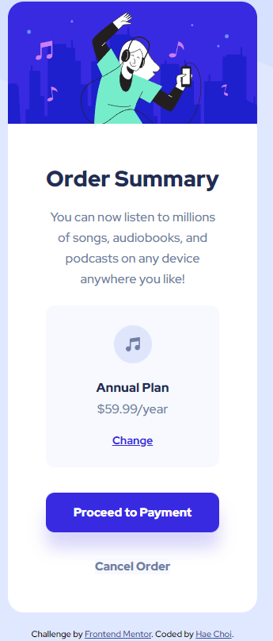

# Frontend Mentor - Order summary card solution

This is a solution to the [Order summary card challenge on Frontend Mentor](https://www.frontendmentor.io/challenges/order-summary-component-QlPmajDUj). Frontend Mentor challenges help you improve your coding skills by building realistic projects.

## Overview

### The challenge

Users should be able to:

- See hover states for interactive elements

### Screenshot

## My process

### Built with

- Semantic HTML5 markup
- CSS custom properties
- Flexbox

### What I learned

- Difference between cover and contain for background-size
- EM unit is useful for things like padding on a button element
- Flex containers cannot shrink any less than the widths of the items allows it to, nowrap is default
  -- Container may not respect padding placed on the body if it cannot shrink in width
- What is seemingly possible with figma may not be achievable in web dev

### Continued development

- Faster time for completion
- Eyeballing distances
- Responsiveness

### Useful resources

- [Example resource 1](https://developer.mozilla.org/en-US/docs/Learn/CSS/Building_blocks/Values_and_units) - Explains various units of length
- [Example resource 2](https://css-tricks.com/snippets/css/a-guide-to-flexbox/) - Classic flexbox guide

## Author

- Frontend Mentor - [@dagimchi](https://www.frontendmentor.io/profile/dagimchi)
- Twitter - [@dagimchi](https://www.twitter.com/dagimchi)

## Acknowledgments

The internet
